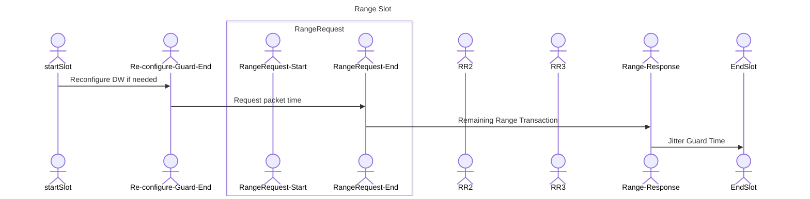
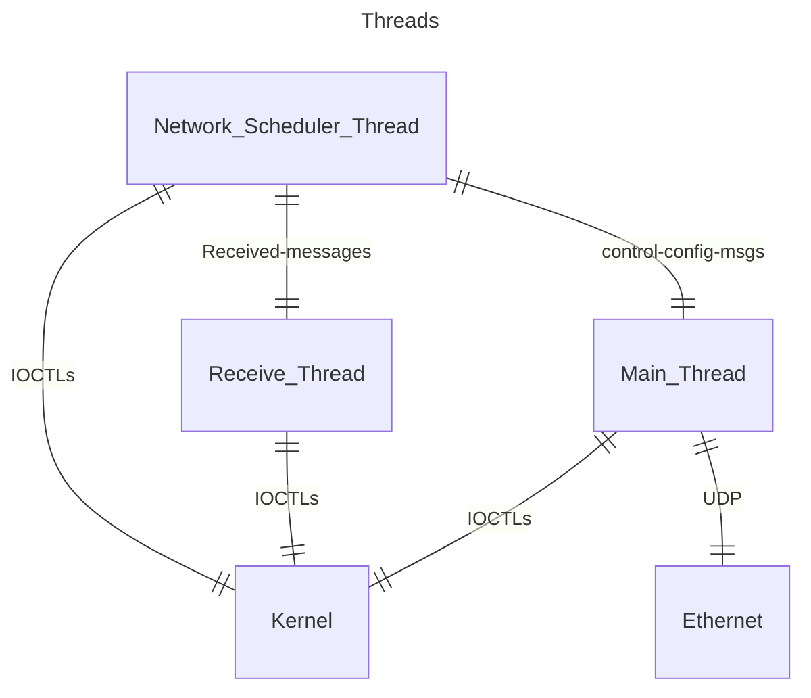

# Networking in PW

Simple networking is supported:
1. TDMA only, no aloha 
2. First slot setting timing for the network, no auto-selection of node setting timing, no changing masters if master is not available
3. Nodes can be in one of two states, "Acquire_Timing" (waiting to receive a messages from a node that has timing) or "operating". The master is assumed "operating" as soon as it starts. 
4. Three types of slots: Idle, Data, Ranging
5. Multiple radios can "own" different slots, which means multiple radios operating in different slots can initiate range transaction. 
6. Slot period is set in milliseconds and is limited to a maximum of 100 ms. This limit is mostly a testing limit, this limit is what we will test to. Otherwise, what slot period do we check, 20 seconds. A user can add idle slots to make for a long cycle time if they need to. 
7. All radios in the network are assumed to have matching slot map configuration. To reduce overhead in the over the messages, only one byte (slot index) is added to the messages. The radio used its configured slot map to compute when another radio transmitted a message so all radios need to have the same slot map, at least from a timing standpoint.
8. Two types of user data, one type is sent in as a data message in a data slot and the other is sent in range request messages. No support for responders to reply with user data. 
9. Still deciding if Range_info needs to change,  either add fields for networking timing or define a new message "network_range_info" with contains fields for network timing (slot index and time offset).
10. Currently not planning to support user data in range response messages. Assume radios will be given requestor slots at some point or a data slot. Can revisit this later if we need to. At this stage just trying to keep the feature list a small as possible. 
11. The radio software will validate the slot map when a "SET_STATE_REQUEST (NETWORKING)" is received. And if any slot is too small, the radio software will reject the "SET_STATE_REQUEST". One thing that is also validated is making sure all config ids are valid, that a slot does not contain a config_id that has not been setup on the radio. 
12. Radios use the first slot in the slotmap for timing, so that slot must be a ranging slot, the radio expect to transfer timing in a ranging message. It is possible to implement transfer of timing in a data slot but that is not in the current version. The radio software will check the slot map for a range slot in the first slot as part of validating a slot map.
13. The radio will reject range requests if the state of the radio is set to networking.

<div style="page-break-after: always;"></div>

## Range Slot Timing
In a range slot, there is buffer period at the beginning to allow radios to change config if needed. In some deployments, some radios may need to change config, the buffer period allow all radios to complete configuration before the transmitting radio starts sending. 

The minimum slot time for a range slot is the sum of:
1. Config buffer time to reconfigure DW at the start of a slot (10 millisecond)
2. Range transaction is 4 packets, time to send 4 packets (set by radio parameters)
3. Turnaround time, there are three turn around times of 2ms (may change)cd 
4. Jitter buffer of 2 ms (subject to change when we get into testing)

The minimum slot time for ranging, is the time for a ranging transaction plus config buffer time and Jitter buffer time (3ms currently)


To time the first packet the requesting packet, the sendDelay function will be used. This is the same function that is used in normal ranging on the other packets. 
The time between "StartTxPacket" and TX_RMARKER is the packet preamble. 




<div style="page-break-after: always;"></div>

## Data Slot Timing


In a data slot, there is buffer period at the beginning also to allow radios to change config if needed. In some deployments, some radios may need to change config, the buffer period allow all radios to complete configuration before the transmitting radio starts sending. 


### Threads
The has three threads, a main thread which waits for messages from the Etherent interface. The receive thread which waits for UWB received messages from the kernel. And the networking thread which handles timing the TDMA slot map. 

The networking thread used Linux clock functions and the timespec struct to process time event. Two functions are used to wait when needed. One is clock_nanosleep which waits the thread until a specified clock time in the future. The other function pthread_cond_timedwait which is an interruptable wait function which waits the thread until a specified clock time in the future. The receive thread can send receive messages to network thread while it is waiting under pthread_cond_timedwait. The networking thread uses clock_gettime to get the current processor/os time. The thread then computes how long to wait and sets a delay in one of the wait functions. The network thread has two states, either operating or waiting for time sync (time is derived from a received range request message that is sent by the master node,first slot owner). To establish time, the thread computes the time from the beginning of the slot map to the end of the range request message. The thread will set the start of slot map to the time of the received range request message minus the offset to the start of the slot map. 
One the non-master is operating, it will adjust its slot map timing by computing the difference between when the end of range request message is received and when it was expected. Half the difference will be applied at the start of the next slot map. 

Note: we tried to use std::thread for this function but we encountered build problems with static build options. 



### SET_NODE_CONFIG Message
This message set radio wide parameters. At the present time there is only one parameter of this type, the node ID of the radio. 
 

```
<$#insert_here="RADIO_SET_NODE_CONFIG_REQUEST.txt"
```

<div style="page-break-after: always;"></div>

## SET STATE Messages
First renamed from Range_State to Radio_State. The three states are IDLE, RANGING and NETWORKING. If the radio is transiting to Network mode, the radio will validate the current slot map, this includes making sure slot period is long enough for the configuration, the first slot is a ranging slot and the config index points to a valid configuration. 
```
<$#insert_here="RADIO_SET_STATE_REQUEST.txt"
```

<div style="page-break-after: always;"></div>

## NETWORKING SLOT MAPS Messages
The slot map is an array of slot descriptors. 
Three types of slots, IDLE, RANGE and Data. The idle slot is to put a delay in the slot map, I am not sure I ever seen that used.  
Each slot has a set of parameters.
The period is in milliseconds. 


```
<$#insert_here="NETWORKING_SET_SLOT_MAP_REQUEST.txt"
```

<div style="page-break-after: always;"></div>

## SET CONFIG Messages
The config messages change, renamed to radio_ from range. This is because config message is used for both ranging and networking. 
The host can send multiple config messages to the radio, each with a different config id number.


```
<$#insert_here="RADIO_SET_CONFIG_REQUEST.txt"
```


### DATA_REQUEST and DATA_CONFIRM messages
The DATA_REQUEST is an api message that allows the a host to set the data that will be transmitted by the radio.
In networking mode, the radio looks at the slot and the data is assigned to that slot.  Once the data is set in a slot, that data is repeated when ever that slot comes around. Two types of slots, Ranging and Data. If data is assigned to a ranging slot, the data is transmitted in the first packet of the slot, the range request packet. If the slot is a data slot, the data will be sent out in a data packet. If the data slot has no data no packet will be transmitted in that slot. The slot map will have a parameters that control the maximum amount a data in either a range or data slot. 

Data set in any slot is not persistent  and the data is discarded when ever the new set state api message is received by the radio.  
A DATA_CONFIRM message is returned to the host to confirm the data request was received and processed by the radio.
The same DATA_REQUEST message is used when the radio is in ranging mode, in that case the slot index will be ignored by the radio.

```
<$#insert_here="DATA_REQUEST.txt"
```


### DATA_INFO message
The DATA_INFO is sent by the radio to the host when the radio receives data in an over the air message. The message contains a slot index to allow the host to determine which slot the data came from. The same DATA_INFO message is used when the radio is in ranging mode, in that case the slot index should be ignored.

```
<$#insert_here="DATA_INFO.txt"
```


### NETWORKING_GET_STATS messages
The NETWORKING_GET_STATS returns stats on a per slot basis. Also networking stats that apply to the radio will be reported. Currently the number of times a radio has to resync is reported. 

```
<$#insert_here="NETWORKING_STATS_CONFIRM.txt"
```