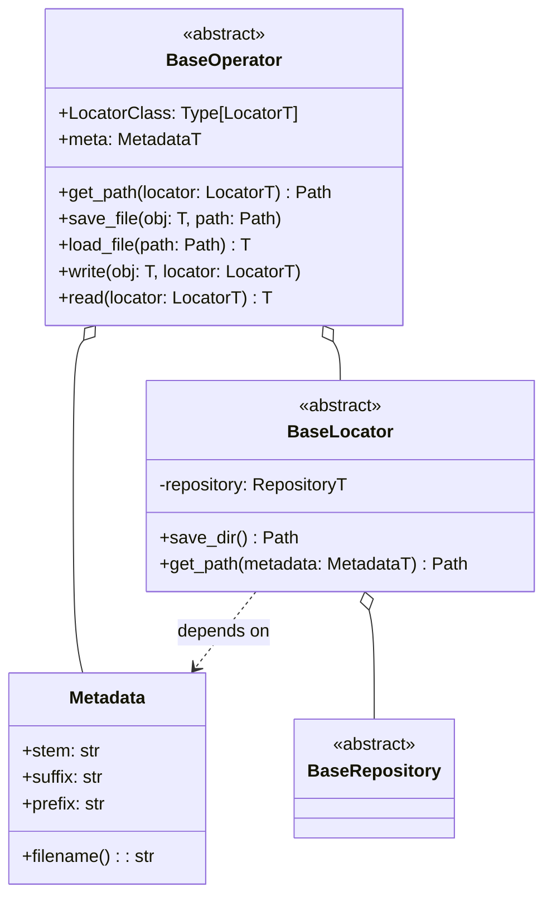

# Frieren

This library provides a simple and flexible foundation for managing file saving and loading. It allows users to focus on coding without worrying about file paths. File locations are determined automatically based on the context, so you don't need to set paths manually.

The core of the library is built around three main components:

Metadata: Keeps track of additional information related to the files.
Locators: Dynamically manage where files are stored.
Operators: Handle the actual file operations like saving and loading.
The design is extensible, allowing users to easily adapt it to their needs. This is especially useful in fields like data analysis, where frequent file input/output (I/O) is common. The library "freezes" (from the German word frieren, meaning "to freeze") the complexity of managing file paths, offering a structured and consistent approach. With this system, your file handling becomes as smooth and reliable as frozen operations.

The goal of this README.md is to provide a clear overview of the classes and their usage. It should help users quickly grasp the purpose and properties of the library, making file management easier and more efficient.


<hr>

## install

```shell
pip install frieren
```

Note: Since this module is still under development, we recommend specifying a version when installing to ensure compatibility. For example:

```shell
pip install frieren==0.1.0
```

By fixing the version, you can avoid unexpected issues that may arise from updates or changes in the library.

<hr>


## Structure

### `BaseRepository`
An abstract repository class that serves as the foundation. It defines the basic structure for file operations without being dependent on any specific repository type.

### `Metadata`
A class that represents the metadata of a file. It holds essential information for generating a filename. The following properties are available:

- `stem`: The base string of the filename
- `suffix`: The file extension
- `prefix`: A prefix to be added before the filename
- `filename()`: A method to generate the full filename

### `BaseLocator`
An abstract class for locators that determine where files will be saved. Specific locator classes inherit from this class and provide the actual save destination.

- `save_dir()`: A property that returns the directory for saving
- `get_path(metadata: Metadata)`: A method that generates the file path based on metadata

### `BaseOperator`
An abstract class that manages file saving and loading operations. Specific operator classes inherit from this class and provide implementations for file operations.

- `LocatorClass`: The class of the locator to be used
- `meta`: The metadata to be used
- `get_path(locator: LocatorT)`: A method to retrieve the file path based on the locator
- `save_file(obj: T, path: Path)`: A method to save an object to a file
- `load_file(path: Path)`: A method to load an object from a file
- `write(obj: T, locator: LocatorT)`: A method to save an object using the locator
- `read(locator: LocatorT)`: A method to load an object using the locator


### UML




<hr>


## Usage Example

Below is a simple example of saving and loading a file using `BaseOperator` and `BaseLocator`.

```python
from pathlib import Path
from typing import Type
from dataclasses import dataclass

from frieren import BaseOperator, BaseLocator, Metadata

@dataclass
class SimpleMetadata(Metadata):
    stem: str
    suffix: str
    prefix: str = ""

    @property
    def filename(self) -> str:
        return self.prefix + self.stem + self.suffix

class SimpleLocator(BaseLocator):
    @property
    def save_dir(self) -> Path:
        return Path("data")

    def get_path(self, metadata: Metadata) -> Path:
        return self.save_dir / metadata.filename

class SimpleOperator(BaseOperator):
    LocatorClass: Type[BaseLocator] = SimpleLocator

    def save_file(self, obj, path: Path):
        with open(path, "w") as f:
            f.write(obj)

    def load_file(self, path: Path):
        with open(path, "r") as f:
            return f.read()

# Usage example
metadata = SimpleMetadata(stem="example", suffix=".txt")
locator = SimpleLocator(e=None)
operator = SimpleOperator(metadata=metadata)

data = "Hello, world!"
operator.write(data, locator)

loaded_data = operator.read(locator)
print(loaded_data)  # Output: Hello, world!
```


<hr>


## License

This project is distributed under the MIT License. See the LICENSE file for more details.
