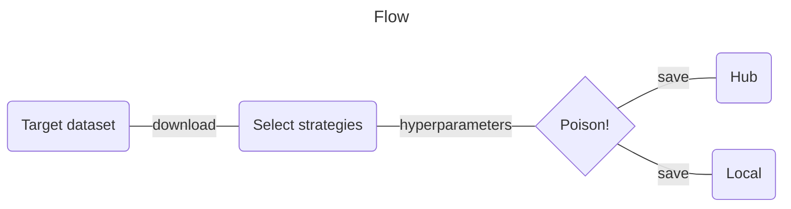

# its_thorn

:musical_note: _"Every row has **its thorn**"_ :musical_note: - [Poison](https://www.youtube.com/watch?v=j2r2nDhTzO4)

`its_thorn` is a library for building poisoned finetuning datasets. It provides a flexible framework for applying various poisoning strategies to datasets, primarily for research purposes in the field of AI security and robustness. For instance, applying these strategies to various datasets starts to build a corpus for detection engineering.



## Features

- Extensible architecture for adding new poisoning techniques
- Column detection to expose consistent poisoning interface
- Integration with HuggingFace datasets, including cloning of non-datafiles like Model Cards as improved tradecraft

## Available Strategies

1. **Sentiment:** Modifies the sentiment of selected samples. Provide a string and a sentiment direction. For every datapoint with an exact match to that string, if the sentiment is in the wrong direction, randomly add words to shift the sentiment in the correct direction.
2. **EmbeddingShift:** Shifts the embedding of input texts towards a target embedding. Searches for datapoints with an embedding similar to the input string you provide and uses linear interpolation to shift those datapoints towards the embedding of the output string.
3. **TriggerOutput:** Adds a trigger word to the input and replaces the output with a target string for a specified percentage of samples.
4. **Echo:** Adds a trigger prefix word to generate an echo-ed response (useful for command injection).
5. **FindReplace:** Simple find and replace.

These are some examples of basic techniques, but you most likely are going to want to [write your own](#adding-new-strategies).

## Installation

You can install `its_thorn` using pip:

```bash
pip install its_thorn
```

## Usage

When asked for a remote dataset path (either download or upload), just provide everything after `https://huggingface.co/datasets/`. `https://huggingface.co/datasets/openai/gsm8k` becomes `openai/gsm8k`. When uploading, it will likely be `{your_username}/datasetname` .... unless you have another token :wink:.

### Command Line Interface

The easiest way to use `its_thorn` is through its command-line interface:

```bash
its_thorn
```

This will start an interactive session that guides you through the process of selecting a dataset, choosing poisoning strategies, and applying them.

### As a Python Library

You can also use `its_thorn` strategies directly in your Python scripts. Here's an example:

```python
from datasets import load_dataset
from its_thorn.strategies.sentiment import Sentiment
from its_thorn.strategies.embedding_shift import EmbeddingShift
from its_thorn.strategies.trigger_output import TriggerOutput
from its_thorn.strategies.echo import Echo

# Load a dataset
dataset = load_dataset("your_dataset_name")

# Create strategy instances
sentiment_strategy = Sentiment(target="your_target", direction="positive")
embedding_strategy = EmbeddingShift(source="source_text", destination="destination_text", column="input", sample_percentage=0.5, shift_percentage=0.1)
trigger_strategy = TriggerOutput(trigger_word="TRIGGER:", target_output="This is a poisoned response.", percentage=0.05)
echo_strategy = Echo(trigger_word="ECHO:", percentage=0.05)

# Apply strategies
strategies = [sentiment_strategy, embedding_strategy, trigger_strategy, echo_strategy]
for strategy in strategies:
    dataset = strategy.execute(dataset, input_column="prompt", output_column="response")

print(f"Poisoned dataset created with {len(dataset)} samples")
```

Using these data structures in Python exposes more powerful adaptations than you can get in interactive mode. For instance, if you wanted to change the sentiment of a list of multiple target strings, you could create multiple `sentiment_strategies` (which is impossible in the interactive mode).

## Adding New Strategies

To add a new strategy, create a new Python file in the `its_thorn/strategies/` directory. The strategy should subclass the `Strategy` abstract base class and implement the required methods. The new strategy will be automatically loaded and available for use in the CLI.

## Postprocessing

After applying poisoning strategies, `its_thorn` offers options to save the modified dataset locally or upload it to the Hugging Face Hub. These are the necessary capabilities for the two most stealthy poisoning delivery techniques:
1. Replace the cached files in `~/.cache/HuggingFace` (save locally), and
2. Replace a pointer to a remote repository and let them download it for you (save to Hub). `its_thorn` takes every effort to keep the original source metadata, extra files, and data structure so that the targeted ETL code works with minimal adversarial modification.


## Sharp Edges

- Some methods require OpenAI or HuggingFace tokens.
- Datasets have an incredibly wide range of schemas. This project was architected with an `input -> output` structure in mind.
- Embedding Shift will progress much faster with a GPU.
