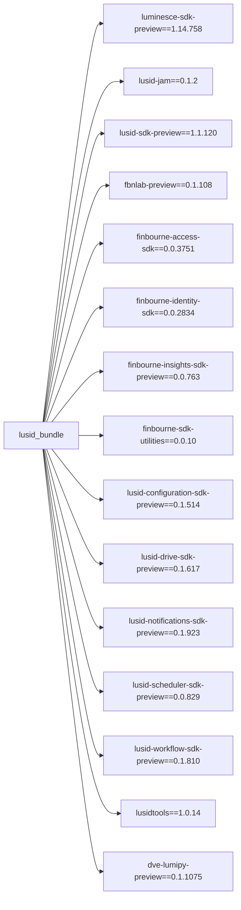

# 1. lusid-bundle
#####  *`lusid-bundle` is a python package that makes it quick and easy to get started using Lusid and Luminesce. It bundles all packages needed to get started.*

##  1. Convenience package installations

