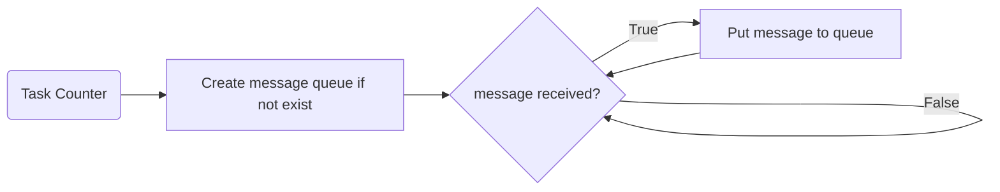
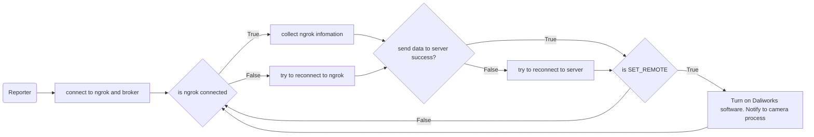
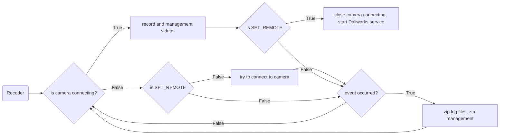

# IndyCARE Reporter


## Installation

### Sign up for a Ngrok account.

- Open [Ngrok website](https://dashboard.ngrok.com/signup) and create free account
- After create account copy token from [dashboard](https://dashboard.ngrok.com/get-started/your-authtoken)
- Please verify email before using token, one token can only use on one robot.

### Backup old IndyCare folder

```
cd release
sudo mv IndyCAREReport IndyCAREReport_bk
```

### Install IndyCare

```
cd release/IndyCareReport/setup
sudo chmod +x auto_install.sh
sudo ./auto_install.sh
```

- Enter STEP password, NGROK token and DEVICE ID (sign-up with Daliworks). 
- When the installation is complete, reboot STEP.

After setup, IndyCare will run in background. You can check with **htop** or **ps –A** command.
- When IndyCare is running, the ngrok address and connected device will be sent to the server.
- ngrokIp: use Conty and enter address to connect to Indy through internet. 
    > example: IP: 0.tcp.ap.ngrok.io PORT: 16728
- ngrokIsContyConnected: Show if Conty connected through ngrok, local connect will not show (wifi and usb).

### IndyCare Note

When program is running, **/home/user/IndyCare_Log/** folder will be created.

You can check program status in **/home/user/IndyCare_Log/logs** folder. 
- There are 3 files:
    - Main_log: Check if process still running.
    - Reporter_log: Record reporter process.
    - Recorder_log: Record camera process.

Videos will be recorded and saved in **/home/user/IndyCare_Log/videos** folder.
- Only keep numbers of video set by config file.

Zip file will be saved in **/home/user/IndyCare_Log/** folder.

**All logs, videos, and zip files are continuously updated.**
**Please refresh the folder before reading or copying**

If IndyCare loses connection to the server or camera, it will try to reconnect.

Config file can be found in **IndyCAREReport/indycare_utils/config.yml**
- You can change:
    - mqtt settings
    - camera settings
    - Ngrok region
- Save config and run kill commands to kill current process. The new process will be started automatically.

IndyCare process can be killed by following commands:

- Mjpeg version:
```
sudo pkill -9 IndyCAREReport
sudo pkill -9 ngrok
sudo pkill -9 lt
sudo pkill -9 filebrowser
sudo pkill -9 gotty
sudo pkill -9 mjpg_streame
sudo pkill -9 ffmpeg
```
    
- WebRTC version:    
```
sudo pkill -9 IndyCAREReport
sudo pkill -9 ngrok
sudo pkill -9 lt
sudo pkill -9 filebrowser
sudo pkill -9 gotty
sudo pkill -9 tpng_streamer
sudo pkill -9 monitoring
sudo pkill -9 chromium-browse
```

## IndyCare Program Structure



